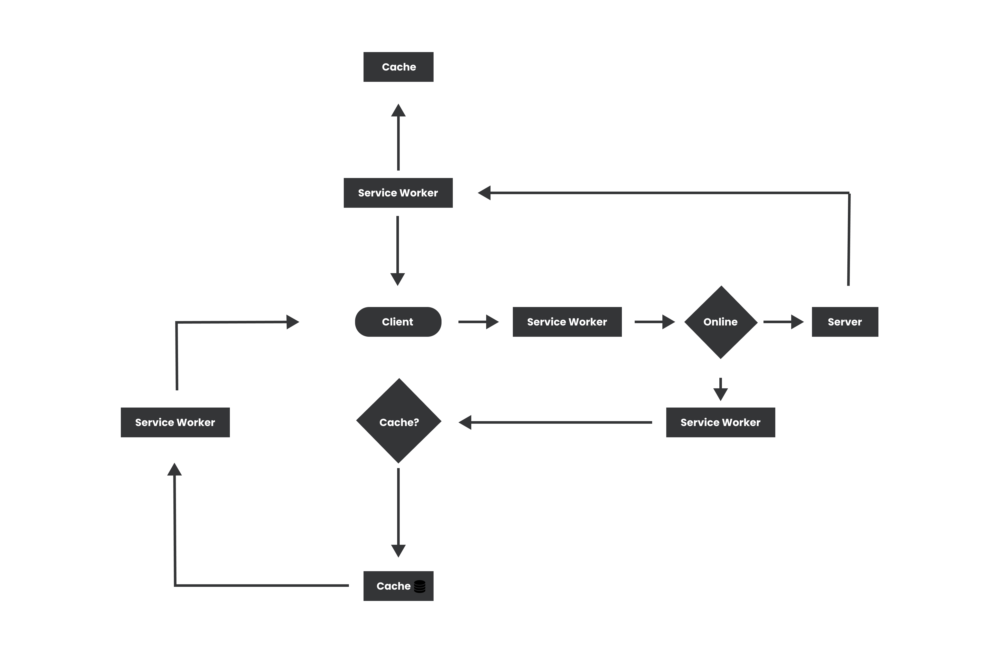
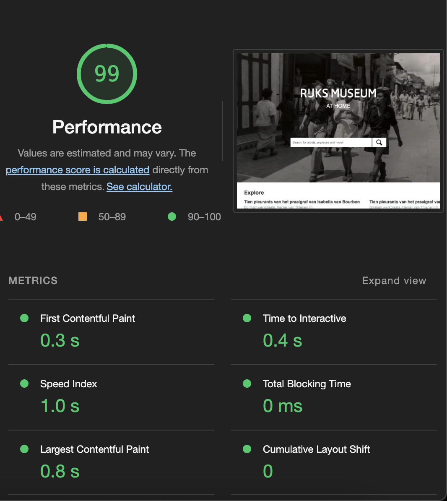

# Rijksflix - Progressive Web App

## Table of contents
- [Client-side vs Server-side](#client-side-vs-server-side)
- [Starting a local host](#starting-a-local-host)
- [Server-side rendering](#server-side-rendering)

## Client-side vs Server-side

### Client-side
Client-side is the side of the website that the user (client) has acces to. A client-side website normally contains static HTML, CSS and Javascript. The benefits of client-side scripts is that you have acces to the DOM. So you can fully controll almost everything the user does and use everything what the client browser offers.

### Server-side
Server-side is the side of the website that the user (client) can't control or has acces to. The down part is that you also can't controll what the user does and what the client browser offers. Server-side scripts process information on the web server when the user requests this information. The benefits of server-side is that it can load scripts before the web page is loaded. This gives you the opportunity to make login systems and cache some important files so that the page performance is good and the user can even use your website offline.

## Starting a local host
This is how I started with server-side rendering. Make sure to install `Node.js` on your device. After that make a project folder. Create for your project folder an `app.js` file and a `public` folder (this is the folder where you can put all your static files like your html, css and images).

### Now follow these steps:
1. Go to your command prompt and direct to your project folder
2. $ npm install
3. $ npm init
4. $ npm install express
5. fill out the information and press enter

If you want to automatically reload your local host on save you can also do: $ npm install nodemon. In your package.json file you can set the scripts to:

```
"scripts": {
    "start": "nodemon app.js"
  },
```

### Using the `app.js` you can start your own local host

```
const express = require('express')
const app = express()
const port = 3000

app.get('/', (req, res) => {
  res.send('Hello World!')
})

app.listen(port, () => {
  console.log(`Example app listening on port ${port}`)
})
```

**That's it! Now you can acces your site with [http://localhost:3000](http://localhost:3000)**

## Server-side rendering
I use `ejs` frameworks to render html (and eventually some javascript).

### My ejs folder structure
```
.
├── ...
├── views
│   ├── partials            *folder with reusable ejs files*
│   │   ├── head.ejs        *head of html*
│   │   ├── foot.ejs        *ending of html*
│   │   └── header.ejs      *the header of the page*
│   ├── index.ejs           *general ejs file*
│   ├── search.ejs          *specific section for searching*
│   └── explore.ejs         *specific section for the starterpage*
└── ...
```


## Service Worker
A service worker is a type of web worker. It's a JavaScript file that runs separately from the main browser thread, intercepting network requests and caching or getting resources from the caches.

### My Service Worker

#### Install Event

I used this event for adding files to the cache.
```
self.addEventListener('install', event => {
    event.waitUntil(
        caches.open(cacheName).then(cache => {
            cache.addAll(cacheAssets);
        })
    )
})
```

#### Activate Event

Used this event for removing old caches so a newer version can be added.
```
self.addEventListener('activate', event => {
    event.waitUntil(
        caches.keys().then(keys => {
            return Promise.all(keys
                .filter(key => key !== cacheName && key !== dynamicCacheName)
                .map(key => caches.delete(key))
            )
        })
    );
});
```

#### Fetch Event

Used for sending the files from the cache to the client.
```
self.addEventListener('fetch', event => {
    event.respondWith(
        caches.match(event.request).then(response => {
            return response || fetch(event.request).then(fetchRes => {
                return caches.open(dynamicCacheName).then(cache => {
                    cache.put(event.request.url, fetchRes.clone());
                    return fetchRes;
                })
            });
        })
    );
});
```

### Activity Diagram

 
## Performance

